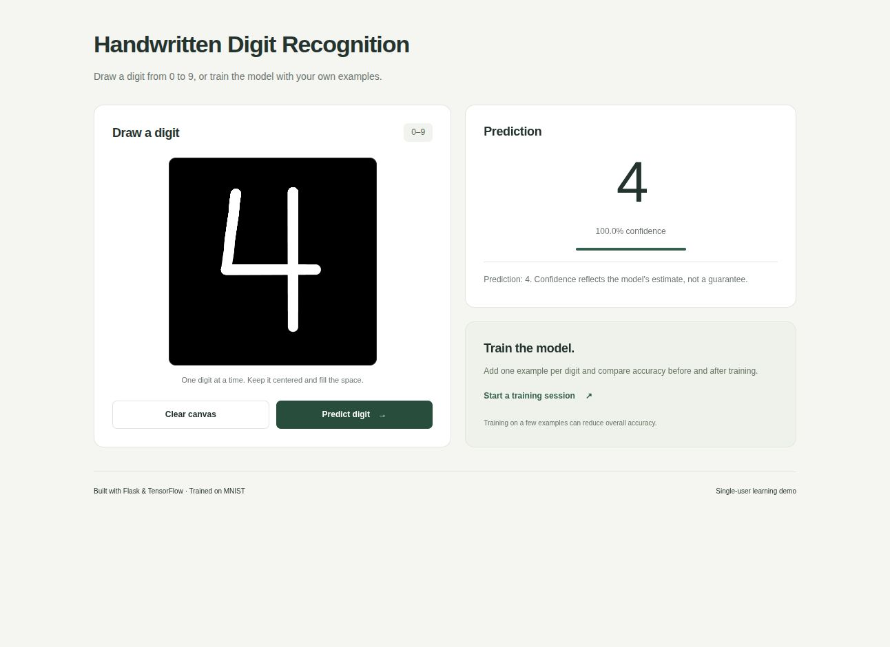

# Handwritten Digit Recognition

A Flask app that recognizes handwritten digits using a TensorFlow model trained
on MNIST. It also supports fine-tuning the model with digits drawn in the browser.



## Features

- Draw and predict digits from 0 to 9
- Display the model's confidence score
- Fine-tune the model with custom drawings
- Compare MNIST test accuracy before and after fine-tuning

## Installation

Python 3.12 is recommended.

```bash
git clone https://github.com/ahmetcskn/digit-prediction.git
cd digit-prediction
python -m venv venv
source venv/bin/activate
pip install -r requirements.txt
```

On Windows, activate the environment with `venv\Scripts\activate`.

## Usage

```bash
python app.py
```

Open `http://127.0.0.1:5000` in a browser. If the model file does not exist, the
app downloads MNIST and trains the model before starting. This can take a few
minutes on the first run.

To train a new model manually:

```bash
python train_model.py
```

## Tests

Create the model first, then run:

```bash
python -m unittest discover -s tests -v
```

## Project structure

- `app.py`: Flask application and fine-tuning flow
- `train_model.py`: MNIST training and model saving
- `utils.py`: Image preprocessing, validation and training charts
- `templates/` and `static/`: Web interface
- `tests/`: Model, preprocessing and route tests

## Notes

This is a single-user demo. Training with a small number of custom drawings may
reduce the model's general accuracy. Generated models, training data, logs and
charts are excluded from Git.
